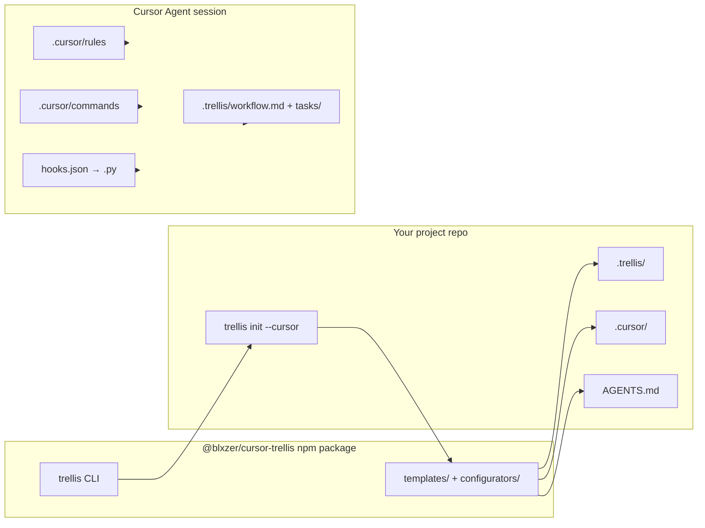

# Architecture overview

English | [简体中文](architecture.zh-CN.md)

This document is a **public, high-level** map of the `cursor-trellis` monorepo and how Trellis reaches a **Cursor** project. Deep implementation notes for maintainers live in [maintainers.md](maintainers.md) (internal, Chinese).

## Problem Trellis solves

Single giant `AGENTS.md` / `CLAUDE.md` / `.cursorrules` files do not scale: agents either miss rules or burn context loading everything. Trellis splits **workflow**, **spec**, **tasks**, and **workspace memory** into files under `.trellis/` and generates **platform adapters** (on Cursor: `.cursor/`).

## Monorepo layout

```text
Trellis/                          # This git repository
  package.json                    # pnpm workspace root
  pnpm-workspace.yaml
  packages/
    core/                         # @blxzer/cursor-trellis-core
    cli/                          # @blxzer/cursor-trellis (bins: trellis, tl, smart-search)
      src/
        cli/                      # Commander entry
        commands/                 # init, update, uninstall, …
        configurators/            # per-platform writers (cursor.ts, …)
        templates/                # embedded templates (cursor/, common/, trellis/, …)
        types/ai-tools.ts        # platform registry
      vendor/smart-search/        # vendored smart-search payload for the smart-search bin
  docs/                           # Public documentation (this tree)
```

| Package | npm name | Role |
| --- | --- | --- |
| `packages/core` | `@blxzer/cursor-trellis-core` | Shared domain primitives (task, channel, mem exports for CLI/services) |
| `packages/cli` | `@blxzer/cursor-trellis` | User-facing CLI, template copy, platform configuration |

Build order: **core before cli** (`pnpm build`). Node **≥ 18.17**, Python **≥ 3.9** for hook scripts in generated projects.

## Cursor data flow (init → agent)



1. **`trellis init --cursor`** (in the user project) detects options, writes `.trellis/` skeleton, then calls `configureCursor()` (`packages/cli/src/configurators/cursor.ts`).
2. **Templates** under `packages/cli/src/templates/cursor/` are read at build time, copied into `dist/`, and rendered with placeholders (Python command path, command prefix `/trellis-`, etc.).
3. **Hash tracking** (`.trellis/template-hashes.json` in the user project) lets **`trellis update`** apply safe template refreshes and optional **migrations** without blindly overwriting customized files.
4. At chat time, **rules** and **AGENTS.md** carry policy; **hooks** add session/shell/subagent context (with Cursor-specific limits on `sessionStart` injection—see [cursor.md](cursor.md)).

## CLI command architecture (simplified)

| Layer | Responsibility |
| --- | --- |
| `src/cli/index.ts` | Commander program, flags, dispatches to command modules |
| `src/commands/init.ts` | Workflow tree, platform selection, template/registry fetch, readiness |
| `src/commands/update.ts` | Version compare, diff vs hashes, migrations, readiness re-check |
| `src/commands/uninstall.ts` | Planned removal/scrub of Trellis-managed paths |
| `src/configurators/*.ts` | Write platform-specific trees from templates |
| `src/utils/*` | File writer, hashes, project detection, capabilities, proxy |

Public docs intentionally go deep only on **init / update / uninstall**; other commands are summarized in the [CLI README](../packages/cli/README.md).

## smart-search integration

The CLI package ships a third binary:

```bash
smart-search --version
```

- **Source layout**: vendored tree at `packages/cli/vendor/smart-search/`, wired through `packages/cli/bin/smart-search.js`.
- **Purpose**: CLI-first web research (search, fetch, doctor, research mode) for agents—see vendor [README](../packages/cli/vendor/smart-search/README.md).
- **Trellis workflow**: `.trellis/workflow.md` and generated agent guidance route **external facts** to smart-search first when healthy; project readiness checks run on `init`/`update` unless `--skip-readiness`.
- **Not** an MCP server: agents invoke the shell command (often via project rules/skills on other platforms; on Cursor, via workflow + maintainer/project policy).

Updating the vendor snapshot is a **maintainer** concern (`pnpm run sync:smart-search` in `packages/cli`); see [maintainers.md](maintainers.md).

## Fork relationship

| Item | Value |
| --- | --- |
| This fork | https://github.com/blxzer77/cursor-trellis |
| Upstream inspiration | https://github.com/mindfold-ai/Trellis |
| Published CLI package | `@blxzer/cursor-trellis` |
| Core SDK | `@blxzer/cursor-trellis-core` |

Public docs describe behavior of **this** repository and package names. They do not document npm release or git push procedures.

## What this document does not cover

- Per-platform deep dives (see [cursor.md](cursor.md) + appendix table).
- `mem` / `channel` CLI subsystems (omitted from public user docs by product choice).
- Release, publish, and private remote policy → [maintainers.md](maintainers.md) and gitignored internal release notes.

## See also

- [Cursor integration](cursor.md)
- [Workflow in Cursor](workflow.md)
- [CLI reference](../packages/cli/README.md)
- [README](../README.md)