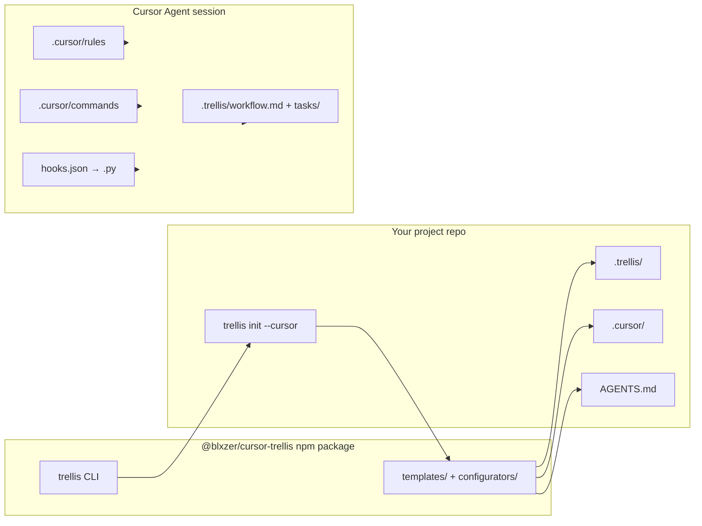

# Architecture overview

English | [简体中文](architecture.zh-CN.md)

This document is a **public, high-level** map of the `cursor-trellis` monorepo and how Trellis reaches a **Cursor** project. Deep implementation notes for maintainers live in an internal handbook (not in the public repo; gitignored).

## What Trellis does

Single giant `AGENTS.md` or `.cursorrules` files do not scale: agents either miss rules or burn context loading everything. Trellis provides a **progressive context management system** that splits workflow, specs, tasks, and workspace memory into structured files under `.trellis/`, then generates **platform adapters** (on Cursor: `.cursor/`) for deep integration.

This is a **Cursor-optimized adaptation** of the original [Trellis framework by mindfold-ai](https://github.com/mindfold-ai/Trellis), focused on individual developers working with AI agents in Cursor.

## Monorepo layout

```text
Trellis/                          # This git repository
  package.json                    # pnpm workspace root
  pnpm-workspace.yaml
  packages/
    core/                         # @blxzer/cursor-trellis-core
    cli/                          # @blxzer/cursor-trellis (bins: trellis, tl)
      src/
        cli/                      # Commander entry
        commands/                 # init, update, uninstall, …
        configurators/            # per-platform writers (cursor.ts, …)
        templates/                # embedded templates (cursor/, common/, trellis/, …)
        types/ai-tools.ts        # platform registry
  docs/                           # Public documentation (this tree)
```

| Package | npm name | Role |
| --- | --- | --- |
| `packages/core` | `@blxzer/cursor-trellis-core` | Shared domain primitives (task, channel exports for CLI/services) |
| `packages/cli` | `@blxzer/cursor-trellis` | User-facing CLI, template copy, platform configuration |

Build order: **core before cli** (`pnpm build`). Node **≥ 18.17**, Python **≥ 3.9** for hook scripts in generated projects.

## Cursor data flow (init → agent)



1. **`trellis init --cursor`** (in the user project) detects options, writes `.trellis/` skeleton, then calls `configureCursor()` (`packages/cli/src/configurators/cursor.ts`).
2. **Templates** under `packages/cli/src/templates/cursor/` are read at build time, copied into `dist/`, and rendered with placeholders (Python command path, command prefix `/trellis-`, etc.).
3. **Hash tracking** (`.trellis/template-hashes.json` in the user project) lets **`trellis update`** apply safe template refreshes and optional **migrations** without blindly overwriting customized files.
4. At chat time, **rules** and **AGENTS.md** carry policy; **hooks** add session/shell/subagent context (with Cursor-specific limits on `sessionStart` injection—see [cursor.md](cursor.md)).

## Retrieval layer and context injection

Trellis routes codebase and external-fact questions through a deliberate **retrieval layer** instead of a single tool. On Cursor, retrieval plans reach the agent through two complementary channels that do **not** depend on the unreliable `sessionStart` injection (#158452):

1. **Per-query plan** — `beforeSubmitPrompt` hook (`inject-retrieval-plan.py`) prepends a `## 代码库检索计划` block to the user prompt, generated by `route_codebase_retrieval.py`.
2. **Always-on policy** — `.cursor/rules/retrieval-routing.mdc` (`alwaysApply: true`) defines default tool order and plan-block execution rules.

The layer spans seven adapters (Core / Enhance / Placeholder) with intent-based routing, three-tier evidence scoring (candidate → corroborated → verified), and result-layer ranking. Semantic backend is environment-dependent: native `@codebase` vs BYOK `fast_context_search`. Full design: [retrieval.md](retrieval.md).

## CLI command architecture (simplified)

| Layer | Responsibility |
| --- | --- |
| `src/cli/index.ts` | Commander program, flags, dispatches to command modules |
| `src/commands/init.ts` | Workflow tree, platform selection, template/registry fetch, readiness |
| `src/commands/update.ts` | Version compare, diff vs hashes, migrations, readiness re-check |
| `src/commands/uninstall.ts` | Planned removal/scrub of Trellis-managed paths |
| `src/configurators/*.ts` | Write platform-specific trees from templates |
| `src/utils/*` | File writer, hashes, project detection, capabilities, proxy |
| `src/templates/trellis/scripts/route_codebase_retrieval.py` | Retrieval intent router (emits plan envelope; see [retrieval.md](retrieval.md)) |

Public docs intentionally go deep only on **init / update / uninstall**; other commands are summarized in the [CLI README](../packages/cli/README.md).

## smart-search: Web research for AI agents

Trellis integrates with [**smart-search**](https://github.com/blxzer77/smart-search), a standalone CLI tool that enables AI agents to retrieve current information from the web. smart-search is automatically installed as a dependency of `@blxzer/cursor-trellis`.

### Installation

smart-search is installed automatically when you install cursor-trellis:

```bash
npm install -g @blxzer/cursor-trellis
# smart-search is now available
smart-search --version
```

### Key capabilities

- **Multi-engine search**: Query across Google, Bing, Brave Search
- **Content extraction**: Fetch and parse web pages with clean text output
- **Deep research mode**: Iterative refinement for complex questions
- **Agent-friendly output**: JSON format optimized for LLM consumption
- **Readiness checks**: Built-in `doctor` command validates configuration

### Integration in Trellis

**Technical details:**
- **Dependency**: `@blxzer/cursor-trellis` depends on `@blxzer/smart-search@^0.1.0`
- **Workflow routing**: `.trellis/workflow.md` and generated agent rules route external fact queries to smart-search first when healthy
- **Readiness validation**: Project readiness checks run on `init`/`update` (skip with `--skip-readiness`)
- **Not an MCP server**: Agents invoke the shell command directly (via workflow + project policy on Cursor)

### Links

- **npm package**: https://www.npmjs.com/package/@blxzer/smart-search
- **GitHub repository**: https://github.com/blxzer77/smart-search

For detailed documentation, configuration options, and contribution guidelines, see the repository.

## Fork relationship

| Item | Value |
| --- | --- |
| This fork | https://github.com/blxzer77/cursor-trellis |
| Upstream inspiration | https://github.com/mindfold-ai/Trellis |
| Published CLI package | `@blxzer/cursor-trellis` |
| Core SDK | `@blxzer/cursor-trellis-core` |

Public docs describe behavior of **this** repository and package names. They do not document npm release or git push procedures.

## What this document does not cover

- Per-platform deep dives (see [cursor.md](cursor.md) + appendix table).
- `mem` / `channel` CLI subsystems (omitted from public user docs by product choice).
- Release, publish, and private remote policy — covered by an internal maintainer handbook (not in the public repo; gitignored).

## See also

- [Cursor integration](cursor.md)
- [Workflow in Cursor](workflow.md)
- [Internal skills](skills.md)
- [Subagent dispatch](subagents.md)
- [Spec system](spec-system.md)
- [Task system](task-system.md)
- [Retrieval layer](retrieval.md)
- [CLI reference](../packages/cli/README.md)
- [README](../README.md)