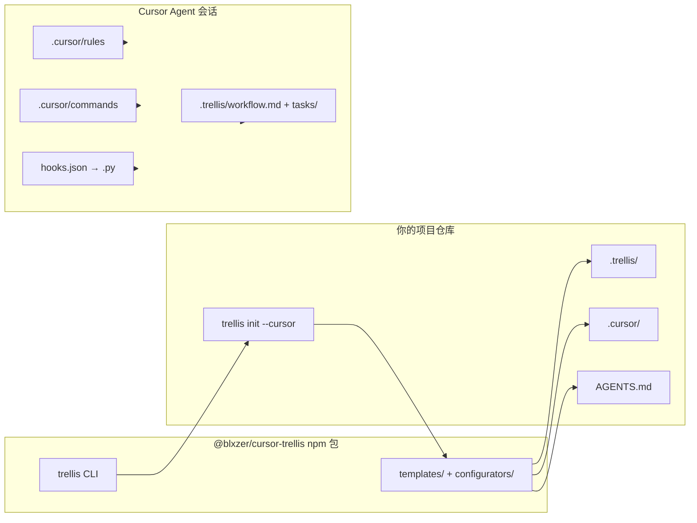

# 架构概览

[English](architecture.md) | 简体中文

本文为 **公开、高层** 的 `cursor-trellis` monorepo 说明，以及 Trellis 如何进入 **Cursor** 项目。维护者用的实现细节见 [maintainers.md](maintainers.md)（内部中文）。

## Trellis 解决的问题

单一的巨型 `AGENTS.md` / `CLAUDE.md` / `.cursorrules` 难以扩展：Agent 要么漏规则，要么为加载全部内容耗尽上下文。Trellis 将 **workflow**、**spec**、**tasks**、**workspace** 拆到 `.trellis/`，并为平台生成适配层（在 Cursor 上为 `.cursor/`）。

## Monorepo 结构

```text
Trellis/
  package.json
  pnpm-workspace.yaml
  packages/
    core/          # @blxzer/cursor-trellis-core
    cli/           # @blxzer/cursor-trellis（trellis、tl、smart-search）
      src/
        cli/
        commands/
        configurators/
        templates/
        types/ai-tools.ts
      vendor/smart-search/
  docs/
```

| 包 | npm 名 | 职责 |
| --- | --- | --- |
| `packages/core` | `@blxzer/cursor-trellis-core` | 共享领域原语（task 等，供 CLI/服务使用） |
| `packages/cli` | `@blxzer/cursor-trellis` | 面向用户的 CLI、模板拷贝、平台配置写入 |

构建顺序：**先 core 后 cli**（`pnpm build`）。Node **≥ 18.17**；生成项目中的钩子脚本需要 Python **≥ 3.9**。

## Cursor 数据流（init → Agent）



1. 在用户项目中执行 **`trellis init --cursor`**，写入 `.trellis/` 并调用 `configureCursor()`（`packages/cli/src/configurators/cursor.ts`）。
2. **模板**位于 `packages/cli/src/templates/cursor/`，构建时拷贝到 `dist/` 并做占位符替换（Python 路径、`/trellis-` 前缀等）。
3. 用户项目中的 **哈希跟踪** 支持 **`trellis update`** 安全刷新模板与可选 **迁移**。
4. 对话时 **rules** 与 **AGENTS.md** 承载策略；**hooks** 补充会话/终端/子 Agent 上下文（`sessionStart` 注入在 Cursor 上有限制，见 [cursor.zh-CN.md](cursor.zh-CN.md)）。

## 检索层与上下文注入

Trellis 将代码库与外部事实问题通过一个**检索层**路由，而非依赖单一工具。在 Cursor 上，检索计划通过两个互补通道到达 Agent，两者都**不**依赖不可靠的 `sessionStart` 注入（#158452）：

1. **每查询计划**——`beforeSubmitPrompt` 钩子（`inject-retrieval-plan.py`）向用户提示预置 `## 代码库检索计划` 块，由 `route_codebase_retrieval.py` 生成。
2. **常驻策略**——`.cursor/rules/retrieval-routing.mdc`（`alwaysApply: true`）定义默认工具顺序与计划块执行规则。

该层涵盖七个适配器（Core / Enhance / Placeholder），基于意图路由，三档证据评分（candidate → corroborated → verified），以及结果层排序。语义后端取决于环境：native `@codebase` vs BYOK `fast_context_search`。完整设计见 [retrieval.zh-CN.md](retrieval.zh-CN.md)。

## CLI 分层（简化）

| 层 | 职责 |
| --- | --- |
| `src/cli/index.ts` | Commander 入口与分发 |
| `src/commands/init.ts` | 工作区、平台选择、远程模板、readiness |
| `src/commands/update.ts` | 版本比对、哈希 diff、迁移 |
| `src/commands/uninstall.ts` | 计划性移除 Trellis 管理路径 |
| `src/configurators/*.ts` | 各平台模板写入 |
| `src/utils/*` | 写文件、哈希、项目检测、能力项等 |
| `src/templates/trellis/scripts/route_codebase_retrieval.py` | 检索意图路由器（输出计划信封；见 [retrieval.zh-CN.md](retrieval.zh-CN.md)） |

公开文档仅对 **init / update / uninstall** 深入；其余命令见 [CLI README](../packages/cli/README.zh-CN.md) 简表。

## smart-search 集成

CLI 包提供第三个可执行文件：

```bash
smart-search --version
```

- **目录**：`packages/cli/vendor/smart-search/`，经 `packages/cli/bin/smart-search.js` 暴露。
- **用途**：面向 Agent 的 CLI 式网页检索（search、fetch、doctor、research 等），见 vendor [README](../packages/cli/vendor/smart-search/README.zh-CN.md)。
- **与 Trellis**：workflow 约定外部事实优先走 smart-search；`init`/`update` 默认做 readiness 检查（可用 `--skip-readiness` 跳过）。
- **不是 MCP**：通过 Shell 调用；在 Cursor 上依赖 workflow 与项目规则指引。

维护者同步 vendor 见 [maintainers.md](maintainers.md)。

## Fork 关系

| 项 | 值 |
| --- | --- |
| 本 fork | https://github.com/blxzer77/cursor-trellis |
| 上游参考 | https://github.com/mindfold-ai/Trellis |
| CLI 包 | `@blxzer/cursor-trellis` |
| Core SDK | `@blxzer/cursor-trellis-core` |

公开文档描述**本仓库**行为，不包含 npm 发布或 git push 流程。

## 本文不涵盖

- 各平台深度说明（见 [cursor.zh-CN.md](cursor.zh-CN.md) 附录）。
- 公开用户文档中不展开 `mem` / `channel` CLI。
- Release/publish 与私有 remote 策略 → [maintainers.md](maintainers.md) 与 gitignore 内部文档。

## 延伸阅读

- [Cursor 集成](cursor.zh-CN.md)
- [Cursor 工作流](workflow.zh-CN.md)
- [CLI 参考](../packages/cli/README.zh-CN.md)
- [README](../README.zh-CN.md)