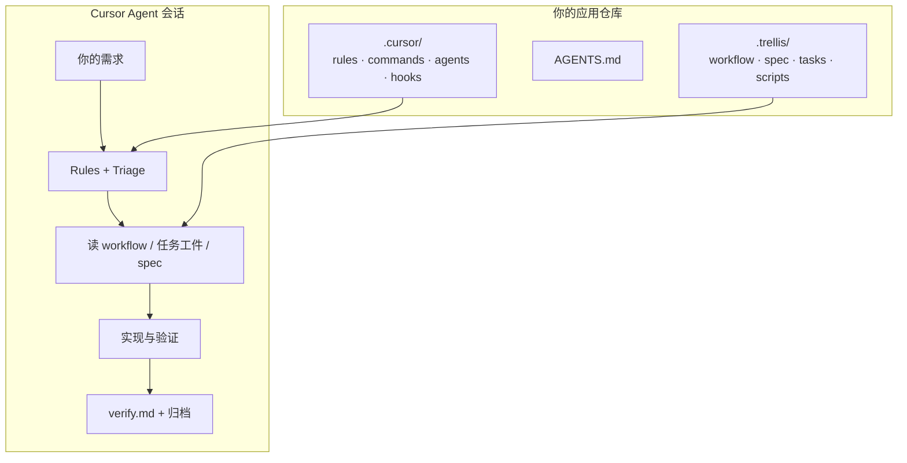
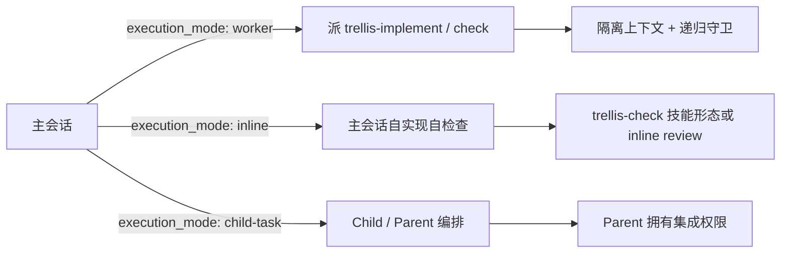
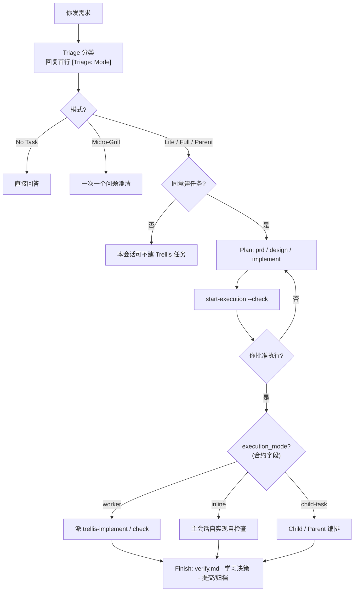
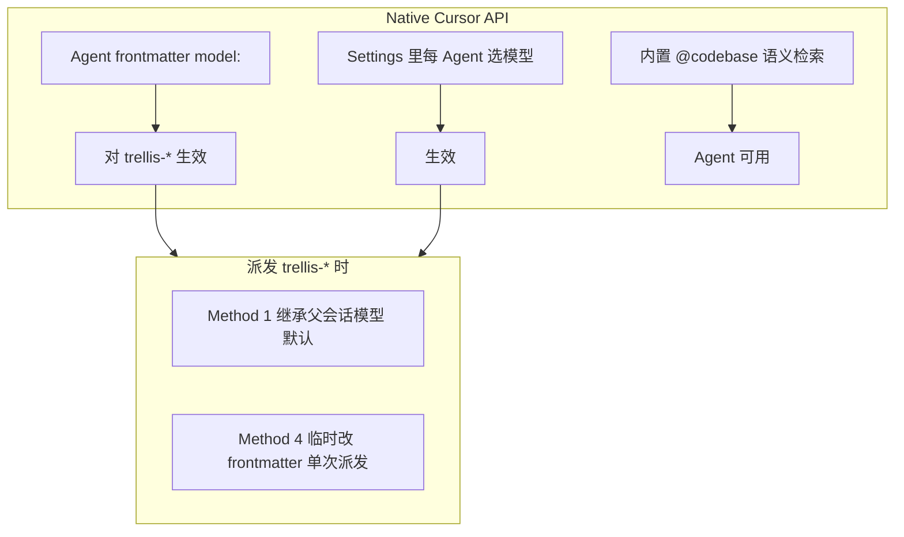
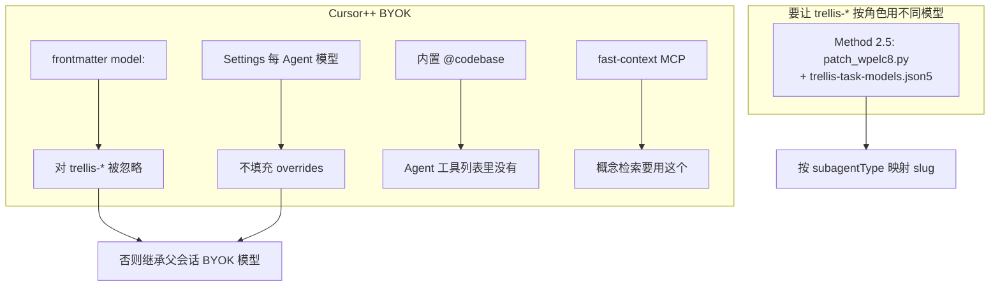

# cursor-trellis:给 Cursor 做的 Trellis 适配,附检索层设计

#### 本帖使用社区开源推广,符合推广要求。我申明并遵循社区要求的以下内容:

- **我的帖子已经打上 #开源推广 标签:** 是 / 否
- **我的开源项目完整开源,无未开源部分:** 是 / 否
- **我的开源项目已链接认可 LINUX DO 社区:** 是 / 否
- **我帖子内的项目介绍,AI生成、润色内容部分已截图发出:** 是 / 否
- **以上选择我承诺是永久有效的,接受社区和佬友监督:** 是 / 否

*以下为项目介绍正文内容,AI生成、润色内容已使用截图方式发出*

---

## 这是什么

社区对 [mindfold-ai/Trellis](https://github.com/mindfold-ai/Trellis) 应该不陌生——`.trellis/` 工件、三阶段生命周期、Parent/Child 任务树、Triage 决策树那套渐进式上下文框架。**cursor-trellis** 就是它的 **Cursor 单平台适配分支**:不铺 16 个平台,只把 Cursor 这一条路做深。

核心取舍是把框架语义落到 Cursor 的原生通道上——`.cursor/rules`(常驻策略)、`commands`(用户可调入口)、`agents`(子 Agent)、`hooks.json`(Python 脚本,会话/检索/派发上下文)。这样 Triage 硬门禁、spec 渐进加载、任务门禁等行为不再依赖容易失效的 session 注入,而是走 `.cursor/rules` 这个可靠通道。




---

## 相对原版 Trellis,做了什么

### 1. 双环境适配(Native / Cursor++ BYOK)

Cursor 有两套用模型的姿势,派发 `trellis-*` 子 Agent 时行为完全不同:


|                            | Native Cursor API  | Cursor++ BYOK                          |
| -------------------------- | ------------------ | -------------------------------------- |
| Agent frontmatter `model:` | ✅ 对 `trellis-*` 生效 | ❌ 被忽略                                  |
| Settings 每 Agent 模型 UI     | ✅ 生效               | ❌ 不填充 overrides                        |
| 概念级语义检索                    | ✅ 内置 `@codebase`   | ❌ Agent 工具列表没有,要用 **fast-context** MCP |


BYOK 下要让 `trellis-*` 按角色固定模型,只能 patch resolver 本身——我们叫 **Method 2.5**(`patch_wpelc8.py` + `~/.ccursor/trellis-task-models.json5`),可逆。Native 用户不需要,frontmatter / Settings 都直接生效。

`trellis init --cursor` 默认走 Native;BYOK 用户加 `--cursor2plus`。

### 2. commands-only 策略

内部技能(`trellis-brainstorm`、`trellis-before-dev`、`trellis-check`、`trellis-break-loop`、`trellis-update-spec` 等 11 个)**刻意不写入 `.cursor/skills/`**。用户可见的 `/` 命令面板只保留精简几个:


| 你做的         | 建议                      |
| ----------- | ----------------------- |
| 接着上次任务      | `/trellis-continue`     |
| 本任务收尾、写验证证据 | `/trellis-finish-work`  |
| 从零提新需求      | 直接说需求;Agent 先 Triage 分类 |


技能语义通过 `.cursor/rules` + `AGENTS.md` + `workflow.md` 传递,由工作流匹配器自动加载。取舍是:单平台深度集成胜过臃肿的技能面板。

### 3. 子 Agent 派发 + 执行策略(0.2.7 新增)

三个 `trellis-*` 子 Agent:`trellis-research`(研究落盘)、`trellis-implement`(实现不提交)、`trellis-check`(独立审查 pass)。主会话**只在合约 `execution_mode: worker` 时**才派实现/审查 Agent:




**执行策略合约(Development Strategy Contract)** 是 0.2.7 新加的:每个 Full/Parent 任务在 `implement.md` 里带一个 YAML 块(`execution_mode` / `isolation` / `verification_profile` 等),决定谁实现、谁检查、在哪隔离。规划时跑 `task.py suggest-execution-strategy <task>` 拿数据驱动的建议(触代码→`worker`,仅文档→`inline`),定稿后合约权威,`start-execution --check` 会在漂移时打 WARN。

上下文加载是**双路径**:主路径是 CLI Layer 2(`task.py generate-dispatch-prompt`)——派发前把 prd/spec/research 预嵌进派发 prompt,并打 `<!-- trellis-hook-injected -->` 标记;`preToolUse` hook 作 best-effort 补充(标记已在就跳过)。子 Agent 见标记直接干活,不见就从 `Selected task: <path>` 手动读 jsonl + 工件。这让派发在 hook 路径失效时(`--continue` 恢复、hooks 禁用等)也稳健。Native 与 BYOK 用同一套机制,与模型路由无关。

### 4. 检索层设计

**外部事实**优先走项目里的 `smart-search` CLI(`doctor` 预检 → 双语 search → Deep Research 编排),Cursor 自带 `WebSearch`/`WebFetch` 只在 smart-search 不可用时作降级 fallback。

**代码库问题**按意图路由:精确串/路径走 Grep、调用链/影响面走 codegraph、跨包同名陷阱走 codegraph 消歧、概念级「这项目怎么工作」Native 用内置 `@codebase` / BYOK 用 fast-context MCP。计划块由 `beforeSubmitPrompt` hook 注入 + `.cursor/rules` 兜底。

### 5. 联网检索依赖 smart-search

外部事实检索依赖配套的 [smart-search](https://github.com/blxzer77/smart-search)——装 cursor-trellis 时作为依赖自动装上。

---

## 怎么用

```bash
`
```

用 Cursor 打开,Agent 模式对话即可。Agent 的工作流(精简版):




**记住两点:**

- **同意建任务 ≠ 同意立刻写代码** — Full 任务会先规划工件,再跑门禁,要你明确批准才 `in_progress`。
- **Triage 是硬门禁** — 有持久性工作时,Agent 应先分类再动手(由 `.cursor/rules` 保证,不依赖容易失效的 session 注入)。

---

## 附录 A:Cursor Native API 环境(可折叠)

> 佬友发帖时可把本节放进折叠块,标题例如:「附录:Native Cursor 环境」

**你怎么判断:** 用的是 Cursor 官方订阅/API 路由,没有 Cursor++ BYOK 那套 `~/.ccursor/providers.json` 代理。




| 能力                         | Native                   |
| -------------------------- | ------------------------ |
| `trellis-*` 子 Agent 单独指定模型 | ✅ frontmatter 或 Settings |
| 概念级「这项目 X 怎么工作」            | ✅ 优先内置语义检索               |
| Method 2.5 BYOK patch      | ❌ 不需要                    |


日常:`**trellis init --cursor` 即可**,不必 `--cursor2plus`。

---

## 附录 B:Cursor++ BYOK 环境(可折叠)

> 佬友发帖时可把本节放进折叠块,标题例如:「附录:Cursor++ BYOK 环境」

**你怎么判断:** 本机有 Cursor++ 数据目录(如 `~/.ccursor/providers.json`),或设置了 `TRELLIS_CURSOR_BYOK=1`。




| 能力                  | BYOK                                               |
| ------------------- | -------------------------------------------------- |
| `trellis-*` 按角色固定模型 | 需 **Method 2.5**(可逆 patch)或接受继承父模型                 |
| 概念级语义检索             | 用 **fast-context** MCP,不是 `@codebase`              |
| 初始化                 | `trellis init --cursor --cursor2plus` + 按文档配 json5 |


完整对照与派发 Method 1–4:[docs/cursor.zh-CN.md](https://github.com/blxzer77/cursor-trellis/blob/main/docs/cursor.zh-CN.md)。

---

## 链接


| 项目                       | 地址                                                                                                                                                                                                                                                                                                                                                                                                                                                  |
| ------------------------ | --------------------------------------------------------------------------------------------------------------------------------------------------------------------------------------------------------------------------------------------------------------------------------------------------------------------------------------------------------------------------------------------------------------------------------------------------- |
| **cursor-trellis**       | [https://github.com/blxzer77/cursor-trellis](https://github.com/blxzer77/cursor-trellis) · npm `@blxzer/cursor-trellis`                                                                                                                                                                                                                                                                                                                             |
| **smart-search**(联网检索依赖) | [https://github.com/blxzer77/smart-search](https://github.com/blxzer77/smart-search) · npm `@blxzer/smart-search`                                                                                                                                                                                                                                                                                                                                   |
| **文档索引**                 | 仓库 `docs/` 中英双语 — [workflow](https://github.com/blxzer77/cursor-trellis/blob/main/docs/workflow.md) · [cursor](https://github.com/blxzer77/cursor-trellis/blob/main/docs/cursor.md) · [skills](https://github.com/blxzer77/cursor-trellis/blob/main/docs/skills.md) · [subagents](https://github.com/blxzer77/cursor-trellis/blob/main/docs/subagents.md) · [task-system](https://github.com/blxzer77/cursor-trellis/blob/main/docs/task-system.md) |
| **原版致谢**                 | [https://github.com/mindfold-ai/Trellis](https://github.com/mindfold-ai/Trellis)                                                                                                                                                                                                                                                                                                                                                                    |


---

**维护:** 仓库 README 与 `docs/` 会随 CLI 模板更新;`trellis update` 可刷新本地 `.trellis/` / `.cursor/` 生成物(注意保留你对 spec 与任务的本地修改)。