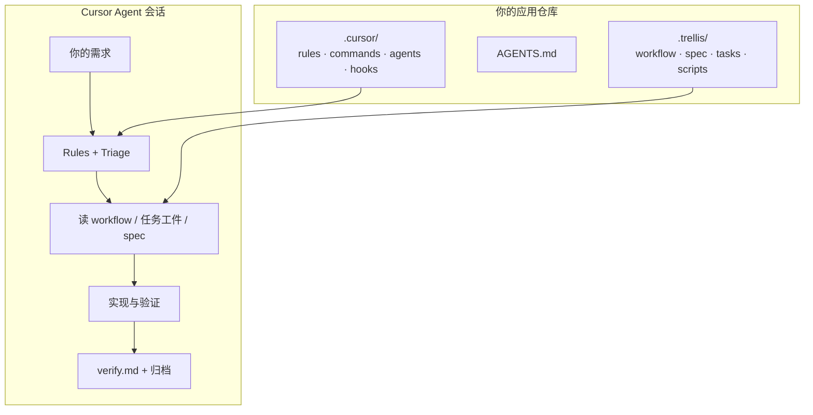
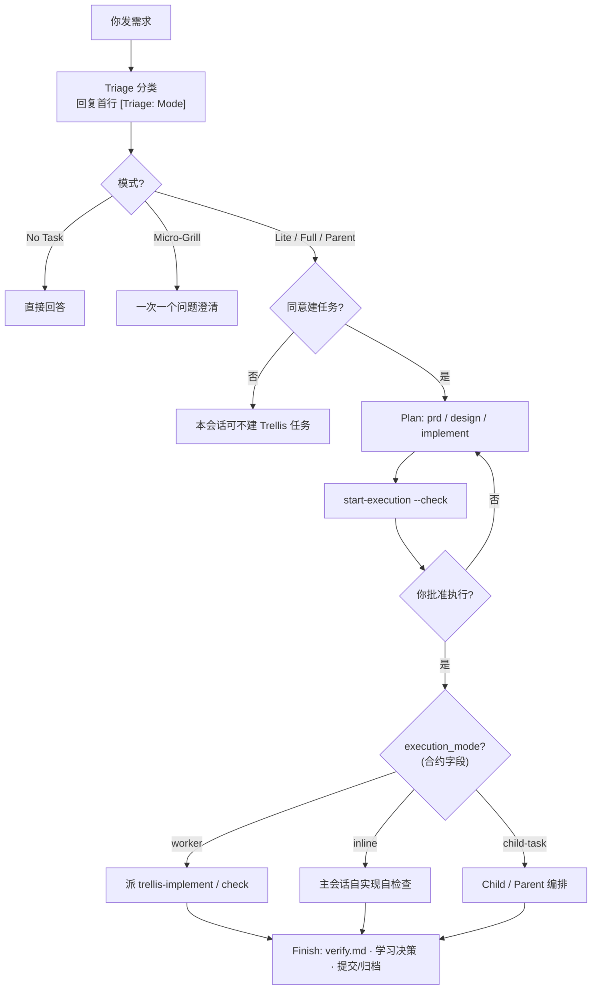
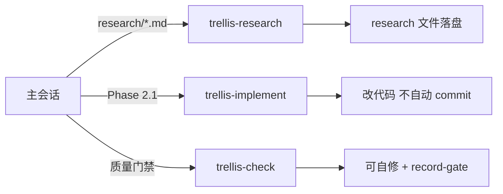
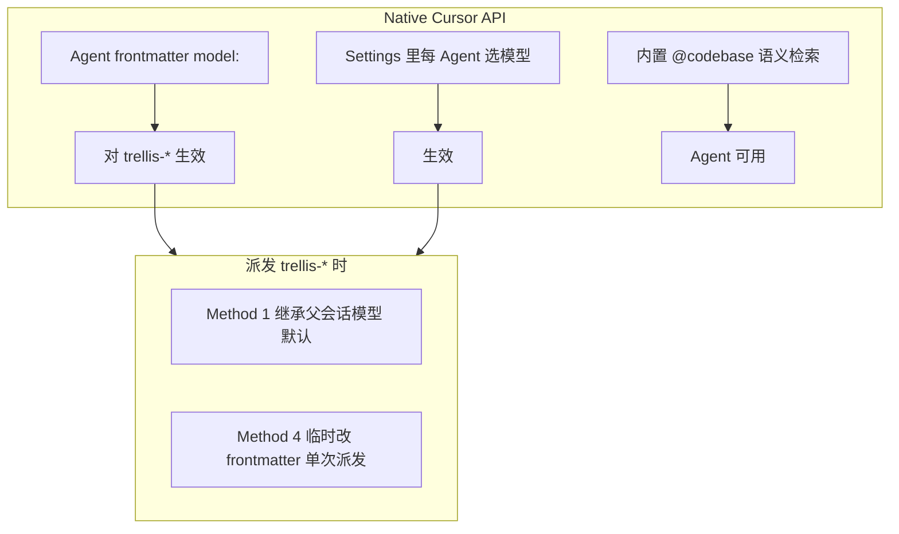
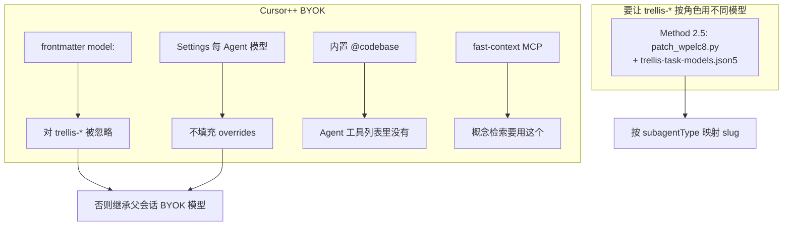

# cursor-trellis:给 Cursor 做的 Trellis 适配,附检索层设计

#### 本帖使用社区开源推广,符合推广要求。我申明并遵循社区要求的以下内容:
* **我的帖子已经打上 #开源推广 标签:** 是 / 否
* **我的开源项目完整开源,无未开源部分:** 是 / 否
* **我的开源项目已链接认可 LINUX DO 社区:** 是 / 否
* **我帖子内的项目介绍,AI生成、润色内容部分已截图发出:** 是 / 否
* **以上选择我承诺是永久有效的,接受社区和佬友监督:** 是 / 否

*以下为项目介绍正文内容,AI生成、润色内容已使用截图方式发出*

---

## 这是什么?

**cursor-trellis** 是一套给 **Cursor Agent** 用的「渐进式上下文 + 任务工作流」脚手架:把 workflow、编码规范(spec)、任务工件(tasks)、开发者笔记(workspace)放在 `.trellis/`,再生成 Cursor 侧集成(`.cursor/` 的 rules、commands、agents、hooks)。

和「一个巨型 `AGENTS.md` / `.cursorrules` 塞满所有规则」相比,它强调两件事:

1. **文件持久化** — 对话会压缩,`prd.md` / `design.md` / `implement.md` / `verify.md` 不会丢,换会话用 `/trellis-continue` 接着干。
2. **按需加载** — 规范按你正在改的包/层渐进读入,而不是每次把整棵 spec 树灌进上下文。

本仓库 fork 自 [mindfold-ai/Trellis](https://github.com/mindfold-ai/Trellis) 思路,**只做 Cursor 单平台做深**(commands-only、hooks、双环境适配、检索路由等),不追求 16 平台铺开。



---

## 适合谁 / 不适合谁

| 更适合 | 可以先不用 |
| --- | --- |
| 多文件重构、要守项目约定 | 单次改一行、纯聊天问 API |
| 跨很多天的功能,要断点续作 | 临时探索、throwaway 脚本 |
| 希望 Agent 先规划再写码、有验收与门禁 | 不想多一步「建任务 / 批准执行」 |

---

## 怎么用(最短路径)

### 1. 安装与初始化

```bash
npm install -g @blxzer/cursor-trellis
trellis --version

cd /path/to/your-app    # 你的项目根,不是本仓库
trellis init --cursor
```

用 **Cursor 打开该仓库**,用 **Agent 模式** 对话即可。

### 2. 你平时会碰到的入口

| 你做的 | 建议 |
| --- | --- |
| 接着上次任务 | `/trellis-continue` |
| 本任务收尾、写验证证据 | `/trellis-finish-work` |
| 从零提新需求 | 直接说需求;Agent 会先 **Triage 分类**,再决定是否建任务 |

用户可见的 `/` 命令刻意保持精简;规划、开发前读 spec、质量检查等 **内部技能** 由工作流自动加载,不堆满命令面板。

### 3. Agent 实际怎么走一遍(概念图)



**记住两点:**

- **同意建任务 ≠ 同意立刻写代码** — Full 任务会先规划工件,再跑门禁,要你明确批准才 `in_progress`。
- **Triage 是硬门禁** — 有持久性工作时,Agent 应先分类再动手(由 `.cursor/rules` 保证,不依赖容易失效的 session 注入)。

### 4. 初始化后目录长什么样

```text
your-app/
  .trellis/
    workflow.md      # 生命周期与 Triage 规范(生成/可本地改)
    spec/            # 分层编码规范(可 bootstrap 填真实项目约定)
    tasks/           # 每个任务的 prd / design / implement / verify
    workspace/       # 开发者日志
    scripts/         # task.py、get_context.py 等
  AGENTS.md          # Trellis 管理的 Agent 入口说明
  .cursor/
    commands/        # /trellis-continue、/trellis-finish-work 等
    rules/           # Triage、检索路由等常驻策略
    agents/          # trellis-research / implement / check
    hooks.json       # 检索计划、子 Agent 上下文等(需本机 Python ≥3.9)
```

更细的 Phase 1–3、Parent/Child 子任务:见仓库 [docs/workflow.zh-CN.md](https://github.com/blxzer77/cursor-trellis/blob/main/docs/workflow.zh-CN.md)、[docs/task-system.zh-CN.md](https://github.com/blxzer77/cursor-trellis/blob/main/docs/task-system.zh-CN.md)。

---

## 三个子 Agent 是干什么的?

当任务合约 `execution_mode: worker` 时,主会话会把「调研 / 实现 / 审查」派到独立上下文(`inline` 模式则主会话自己干;Parent/Child 才是多交付物并行):



- **research** — 外部事实优先走项目里的 smart-search CLI;结论写进 `research/<topic>.md`。
- **implement** — 读任务工件 + `implement.jsonl` 里的 spec 清单;**不负责 git commit**。
- **check** — 可 inline(小改)或 Agent 形态(多文件、要独立审查 pass)。

详见 [docs/subagents.zh-CN.md](https://github.com/blxzer77/cursor-trellis/blob/main/docs/subagents.zh-CN.md)、[docs/skills.zh-CN.md](https://github.com/blxzer77/cursor-trellis/blob/main/docs/skills.zh-CN.md)。

---

## 检索与联网(一句话)

代码库问题:按意图走 Grep / codegraph / 语义检索等组合(计划块由 hook 注入 + rules 兜底)。**外部事实**优先 `smart-search` CLI,Cursor 自带 WebSearch 只在 smart-search 不可用时的降级。细节见 [docs/retrieval.zh-CN.md](https://github.com/blxzer77/cursor-trellis/blob/main/docs/retrieval.zh-CN.md)。

---

## 附录 A:Cursor Native API 环境(可折叠)

> 佬友发帖时可把本节放进折叠块,标题例如:「附录:Native Cursor 环境」

**你怎么判断:** 用的是 Cursor 官方订阅/API 路由,没有 Cursor++ BYOK 那套 `~/.ccursor/providers.json` 代理。



| 能力 | Native |
| --- | --- |
| `trellis-*` 子 Agent 单独指定模型 | ✅ frontmatter 或 Settings |
| 概念级「这项目 X 怎么工作」 | ✅ 优先内置语义检索 |
| Method 2.5 BYOK patch | ❌ 不需要 |

日常:**`trellis init --cursor` 即可**,不必 `--cursor2plus`。

---

## 附录 B:Cursor++ BYOK 环境(可折叠)

> 佬友发帖时可把本节放进折叠块,标题例如:「附录:Cursor++ BYOK 环境」

**你怎么判断:** 本机有 Cursor++ 数据目录(如 `~/.ccursor/providers.json`),或设置了 `TRELLIS_CURSOR_BYOK=1`。



| 能力 | BYOK |
| --- | --- |
| `trellis-*` 按角色固定模型 | 需 **Method 2.5**(可逆 patch)或接受继承父模型 |
| 概念级语义检索 | 用 **fast-context** MCP,不是 `@codebase` |
| 初始化 | `trellis init --cursor --cursor2plus` + 按文档配 json5 |

完整对照与派发 Method 1–4:[docs/cursor.zh-CN.md](https://github.com/blxzer77/cursor-trellis/blob/main/docs/cursor.zh-CN.md)。

---

## 链接

| 项目 | 地址 |
| --- | --- |
| **cursor-trellis** | https://github.com/blxzer77/cursor-trellis · npm `@blxzer/cursor-trellis` |
| **smart-search**(联网检索依赖) | https://github.com/blxzer77/smart-search · npm `@blxzer/smart-search` |
| **文档索引** | 仓库 `docs/` 中英双语 — [workflow](https://github.com/blxzer77/cursor-trellis/blob/main/docs/workflow.md) · [cursor](https://github.com/blxzer77/cursor-trellis/blob/main/docs/cursor.md) · [skills](https://github.com/blxzer77/cursor-trellis/blob/main/docs/skills.md) · [subagents](https://github.com/blxzer77/cursor-trellis/blob/main/docs/subagents.md) · [task-system](https://github.com/blxzer77/cursor-trellis/blob/main/docs/task-system.md) |
| **原版致谢** | https://github.com/mindfold-ai/Trellis |

---

**维护:** 仓库 README 与 `docs/` 会随 CLI 模板更新;`trellis update` 可刷新本地 `.trellis/` / `.cursor/` 生成物(注意保留你对 spec 与任务的本地修改)。