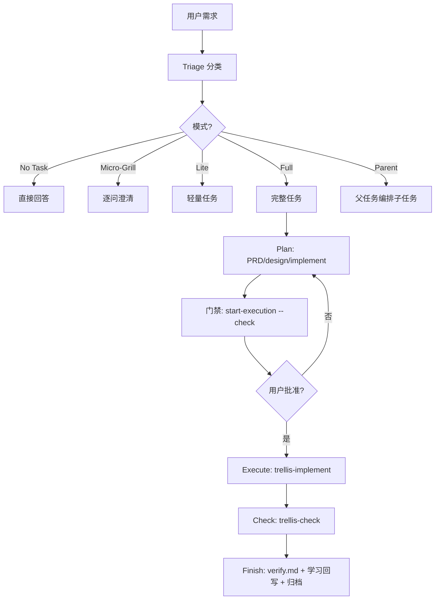
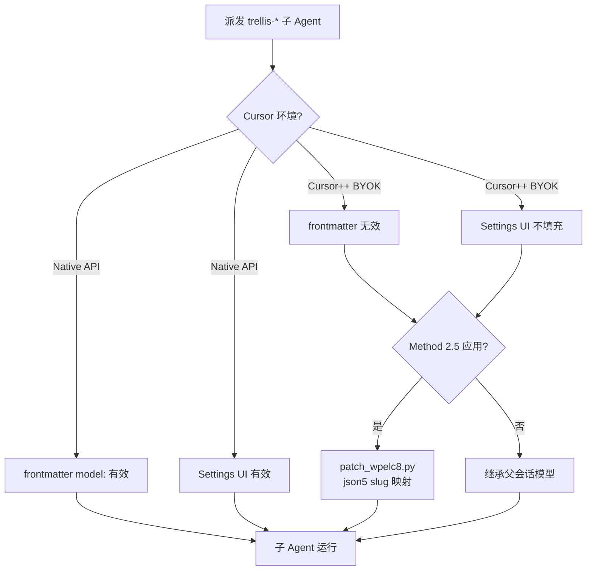

# cursor-trellis:给 Cursor 做的 Trellis 适配,附检索层设计

#### 本帖使用社区开源推广,符合推广要求。我申明并遵循社区要求的以下内容:
* **我的帖子已经打上 #开源推广 标签:** 是 / 否
* **我的开源项目完整开源,无未开源部分:** 是 / 否
* **我的开源项目已链接认可 LINUX DO 社区:** 是 / 否
* **我帖子内的项目介绍,AI生成、润色内容部分已截图发出:** 是 / 否
* **以上选择我承诺是永久有效的,接受社区和佬友监督:** 是 / 否

*以下为项目介绍正文内容,AI生成、润色内容已使用截图方式发出*

---

`cursor-trellis` 是面向 AI 编程 Agent 的渐进式上下文管理系统,基于 mindfold-ai/Trellis 思路,针对 Cursor 深度适配,并新增了一层独立的检索抽象。

背景很朴素:一个项目用久了,Agent 指令就会膨胀成单一巨型 `AGENTS.md` 或 `.cursorrules`。Agent 要么漏规则,要么为加载全部内容耗尽上下文。cursor-trellis 把 workflow、spec、tasks、workspace 拆成结构化文件放在 `.trellis/`,再生成平台适配层(在 Cursor 上是 `.cursor/`)。这篇帖子讲三件事:这个系统长什么样、它的检索层怎么设计、以及它对 Cursor 做了哪些专门适配。

## 一、cursor-trellis 是什么样的

### 核心结构

初始化后,项目里会出现两棵树:

- `.trellis/` — workflow(生命周期)、spec(分层编码规范)、tasks(PRD/design/implement/verify 工件)、workspace(开发者日志)、scripts(任务/上下文脚本)
- `.cursor/` — commands(用户可见斜杠命令)、rules(常驻策略)、agents(子 Agent 定义)、hooks(Python 钩子)

核心思路是**持久化**:任务工件(PRD、设计、实现计划、验证证据)落盘,对话会被压缩但文件不会丢。spec 是**渐进式**加载的 —— 按你正在编辑的文件加载相关规范,不一次性把全部规则灌进上下文。

### Request Triage 与 Task Ladder

这是 cursor-trellis 最有特色的部分。每个能产生工作的回合,**Agent 必须先分类**(这叫 Request Triage,硬门禁),回复首行带分类标记 `[Triage: <Mode>]`。分类按风险与持久性,而不是工作量大小:

| 模式 | 适用 |
| --- | --- |
| **No Task** | 对话、解释、只读查询,无持久改动 |
| **Micro-Grill** | 范围不清的小需求,先逐问澄清 |
| **Lite Task** | 低风险、单文件、本地可验证 |
| **Full Task** | 跨文件行为、框架语义、契约改动 |
| **Parent Task** | 多个独立交付物,父任务编排子任务 |

分类为需建任务的模式后,Agent **必须先征求同意**才创建工件 —— 同意建任务不等于同意写代码,规划先行。然后是三阶段生命周期:



- **Plan**:写 PRD/design/implement 工件,跑 `start-execution --check` 门禁,用户明确批准后 `--approved`
- **Execute**:派发 `trellis-implement` 子 Agent 实现,再派 `trellis-check` 子 Agent 评审
- **Finish**:写 `verify.md` 验证证据、做学习回写(决定是否更新 spec)、提交并归档

### Parent/Child 任务树

一个请求含多个独立交付物时,Parent 编排、Child 独立执行。集成权限**只属 Parent**(`merge_limit: 1` 串行集成),Child 可提供证据但不能自标集成完成。这是原版 Trellis 思路的延续,本 fork 在 Cursor 上落地。

### 与原版 Trellis 的关系

基于 mindfold-ai/Trellis 思路,定位不同:原版面向 16 个平台做通用化,本 fork 聚焦 Cursor 单平台做深 —— 放弃跨平台铺开,换来 Cursor 的深度集成(commands-only 策略、hooks、rules、检索层、双环境适配)。致谢原版,这里不对比优劣,取舍不同而已。

## 二、检索层设计

单一工具回答不了所有代码库问题:Grep 快但不会跟调用链;语义检索擅长"X 是怎么工作的"但不擅长精确调用点;调用链/爆炸半径需要索引图;外部事实需要联网检索。cursor-trellis 把这些做成了一层**适配器栈 + 意图路由器(intent router)**。

### 七适配器三层

| 层 | 适配器 | 用途 |
| --- | --- | --- |
| **Core**(始终可用) | Grep / artifact-search / source-git-tests | 字面检索、Trellis 工件、Git+测试证据 |
| **Enhance**(可选) | codegraph / platform-semantic / smart-search / session-memory | 调用链、语义、外部事实、会话记忆 |
| **Placeholder**(预留) | mcp/browser/network | 未来扩展槽位 |

### Router 与 Cursor 双通道注入

`route_codebase_retrieval.py` 是意图路由器 —— 输入问题,输出 intent + routes + agentInstructions,**只路由不搜索**。

```mermaid
flowchart LR
  Q[用户问题] --> R[route_codebase_retrieval.py<br/>意图路由器]
  R --> Core[Core 层 始终可用]
  R --> Enhance[Enhance 层 可选]
  R --> Placeholder[Placeholder 层 预留]
  Core --> Grep[Grep 字面检索]
  Core --> Art[artifact-search<br/>Trellis 工件]
  Core --> Git[source-git-tests]
  Enhance --> CG[codegraph MCP<br/>调用链/陷阱消歧]
  Enhance --> Sem[platform-semantic<br/>@codebase / fast-context]
  Enhance --> SS[smart-search<br/>外部事实首选]
  Enhance --> Mem[session-memory]
  Grep & Art & Git & CG & Sem & SS & Mem --> E[证据三档<br/>candidate→corroborated→verified]
  E --> V[verify.md 引用]
```

在 Cursor 上,检索计划通过**两个互补通道**到达 Agent:

1. **每查询计划注入** — `beforeSubmitPrompt` 钩子(`inject-retrieval-plan.py`)在用户提示前预置 `## 代码库检索计划` 块,由 router 生成
2. **常驻策略规则** — `.cursor/rules/retrieval-routing.mdc`(`alwaysApply: true`)定义默认工具顺序与执行规则

为什么不用 `sessionStart`?因为 Cursor 的 `sessionStart` 钩子 `additional_context` 字段有已知限制(issue #158452),不可靠地进入 Agent 上下文。所以把持久策略放 always-on rule、每查询计划放 `beforeSubmitPrompt` —— 两者都不依赖 `sessionStart`。

### 证据三档

适配器输出**不是**证明。证据分三档:

- **candidate** — 适配器返回的路径/符号,未确认
- **corroborated candidate** — 两个独立适配器一致,或一个适配器 + Read 确认位置
- **verified claim** — 由当前源码(Read)、Git blame 或通过的测试确认

`get_context.py --mode retrieval-pack` 对收集到的证据 JSON **评分**,它不搜索。

### smart-search 强制首选

外部/时效性事实,`run_smart_search.py`(封装 `@blxzer/smart-search` CLI)是**强制首选**。Cursor 内置 `WebSearch`/`WebFetch` 仅在 smart-search 不可用时(`doctor` not ok、超时等)降级使用。这是刻意的设计 —— web 检索强度在 Trellis 内路由,不留给平台默认。

### Token economy

每条路由带 `tokenEconomy` 标签(high/medium/low)。大仓库(>2000 文件)自动提升 codegraph 优先级,因为结构化查询在大仓库上 token 效率远高于朴素 Grep。

## 三、对 Cursor 平台的适配

Cursor 不是"又一个平台",而是有一组特有约束需要专门处理。

### commands-only 策略

默认**不**向 `.cursor/skills/` 写内部 skill,保持 `/` 命令面板精简。用户可见命令只有 `/trellis-continue`、`/trellis-finish-work` 等。工作流语义通过 rules + `AGENTS.md` + `.trellis/workflow.md` 传递,而不是堆一大堆 skill 到调色板。这与"全平台铺 skills"的通用化思路不同。

### 双环境 Native vs BYOK

Cursor 有两种环境,对子 Agent 派发的模型路由完全不同:

| 能力 | Native Cursor API | Cursor++ BYOK |
| --- | --- | --- |
| Agent frontmatter `model:` | ✅ 有效 | ❌ 对 `trellis-*` 不生效 |
| Cursor Settings 每 Agent 模型 UI | ✅ 有效 | ❌ 不填充 `subagentModelOverrides` |
| Task 子 Agent(`trellis-*`)模型 | ✅ Frontmatter/Settings | ❌ 无 Method 2.5 时继承父会话模型 |



为什么 BYOK 麻烦?因为 Cursor++ 下 frontmatter 与 Settings UI 对自定义 `trellis-*` 子 Agent **都不路由**,只能靠 Method 2.5 patch `extension.js` 解析器,把 `subagentType` 映射到 BYOK 目录的 slug。本 fork 专门做了可逆 patch(`patch_wpelc8.py`),细节在 `docs/cursor.md`。

派发策略有 Method 1-4:

- **1 Inherit**(默认)— 继承父会话模型
- **2 Explore + 自定义模型** — 只读探索,通过 Cursor++ 面板独立模型
- **2.5 BYOK json5 patch** — 可逆 patch,按角色映射 slug
- **3 Manual** — 主会话准备 prompt,用户开新对话手选模型
- **4 Ephemeral**(native only)— 临时改 frontmatter,BYOK 下不生效

### Retrieval 注入通道

呼应主题二,但聚焦"为什么 Cursor 需要特殊处理"。正是因为 `sessionStart` #158452 限制,才催生了 `beforeSubmitPrompt` + `alwaysApply` rules 的双通道设计。这不是通用做法,是 Cursor 特有约束倒逼的。

### hooks

`hooks.json` 注册 Python 脚本(init/update 时解析 `{{PYTHON_CMD}}` 占位符):

| Hook | 作用 |
| --- | --- |
| `sessionStart` | 会话启动(受 Cursor 注入能力限制) |
| `preToolUse` | 子 Agent 上下文注入(尽力而为) |
| `beforeSubmitPrompt` | 每查询检索计划注入 |
| `beforeShellExecution` | 终端/Shell 会话上下文 |
| `stop` | 回合结束检索包(调研流) |

需要本机 Python ≥ 3.9。这些钩子用来补 Cursor 自身注入能力不足的短板。

## Quick Start

```bash
# 1. 安装
npm install -g @blxzer/cursor-trellis
# 2. 初始化(在你的项目,不是本仓库)
cd /path/to/your-app
trellis init --cursor
# 3. 用 Cursor 打开项目,Agent 模式
# 4. 试试 /trellis-continue 或直接发需求,看 [Triage: ...] 标记
```

可选:`trellis init --cursor --cursor2plus` 启用 Cursor++ BYOK 本地包。

## 链接

- **cursor-trellis**:https://github.com/blxzer77/cursor-trellis (npm: `@blxzer/cursor-trellis`)
- **smart-search**:https://github.com/blxzer77/smart-search (npm: `@blxzer/smart-search`)
- **文档**:仓库 `docs/` 双语 — [workflow](https://github.com/blxzer77/cursor-trellis/blob/main/docs/workflow.md) / [retrieval](https://github.com/blxzer77/cursor-trellis/blob/main/docs/retrieval.md) / [cursor](https://github.com/blxzer77/cursor-trellis/blob/main/docs/cursor.md) / [architecture](https://github.com/blxzer77/cursor-trellis/blob/main/docs/architecture.md)
- **原版致谢**:https://github.com/mindfold-ai/Trellis
