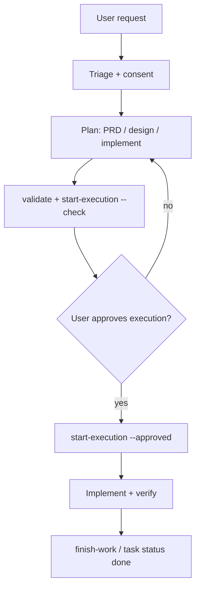

# Workflow in Cursor

English | [简体中文](workflow.zh-CN.md)

This guide explains how to run the **Trellis task lifecycle** inside **Cursor** after `trellis init --cursor`. It covers the full lifecycle: Request Triage, the Task Ladder, planning artifacts, Parent/Child task trees, the three phases (Plan → Execute → Finish), and the differences between Lite, Micro-Grill, and No Task turns.

The canonical rules live in your project's `.trellis/workflow.md` (generated/updated by Trellis). Cursor agents also see **Request Triage** via `.cursor/rules/trellis-triage.mdc`.

## Prerequisites

1. Install the CLI: `npm install -g @blxzer/cursor-trellis`
2. In your repo root: `trellis init --cursor`
3. Open the project in Cursor and use **Agent** mode for durable work.

Optional: run `python ./.trellis/scripts/get_context.py` in a terminal to see the active task and phase hints.

## Request Triage (every turn)

Before durable work, the agent classifies the user message against a decision tree. This is a **hard gate**, not a suggestion — every work-capable turn must be classified FIRST, before any action.

Decision tree (first match wins):

1. **No durable project change** (conversation, status, explanation, read-only lookup, tiny one-turn action) → `No Task`
2. **Underspecified small request, no task yet** (needs focused clarification or decision pressure before work exists) → `Micro-Grill`
3. **Low-risk durable work, narrow scope, local validation, no shared contract** → `Lite Task`
4. **Durable code/template/runtime/workflow/cross-file behavior, or framework semantics** → `Full Task`
5. **Multiple independent deliverables, staged/parallel execution, or final integration authority** → `Parent Task / Child Tasks`

The first line of an agent reply must include the classification mark:

```
[Triage: <Mode>] <one-sentence reason citing the trigger signal>
```

`<Mode>` ∈ `No Task | Micro-Grill | Lite | Full | Parent`. The reason must cite the trigger signal (e.g. "cross-file workflow change", "read-only explanation"). For `No Task` turns the mark is still required — it is how the user audits that classification happened.

### Consent gate

After classifying into Micro-Grill / Lite / Full / Parent, the agent asks for **task-creation consent** before creating any Trellis artifact. User consent to create a task is **not** consent to start coding — planning still happens first. If the user declines a task for a simple request, skip Trellis for this session.

### Selected-task continuity

When a `selected_task` already exists, the agent does **not** re-run global classification on every follow-up. It continues inside the selected task unless a strong conflict exists: explicit exit/switch/create language, an out-of-scope request, a different task artifact or archive target, a new independent deliverable, a contract-changing request, or evidence pollution risk.

## Task Ladder and routing

Classify by **risk and persistence**, not raw effort size. A short change to durable framework semantics can require a Full Task; a long conversation can remain No Task when it leaves no durable project state.

| Mode | Use when | Trigger signals | Durable artifacts |
| --- | --- | --- | --- |
| **No Task** | Conversation, status, explanation, read-only lookup, or a tiny one-turn action with no durable project change. | explain / status / lookup / read-only / one-liner | None. No archive unless upgraded. |
| **Micro-Grill** | The user needs focused clarification, decision pressure, or a small requirement interrogation before deciding whether work exists. | small + underspecified / "depends" / needs clarification / decision tree first | Usually none. Upgrade before durable edits, validation, gates, or archive evidence. |
| **Lite Task** | Low-risk durable work with narrow scope, local validation, and no shared contract change. | low-risk / single file / local validation / no contract / narrow scope | `task.json`, `prd.md`, `verify.md`, and archive evidence. |
| **Full Task** | Durable code, template, runtime, workflow, or cross-file behavior where design, execution strategy, validation, or reviewer gates matter. | cross-file / framework semantics / contract change / template / runtime / workflow / multi-file behavior | `prd.md`, `design.md`, `implement.md`, `verify.md`, Development Strategy Contract, `verification_profile`, `quality_gates`, and archive evidence. |
| **Parent Task / Child Tasks** | One request contains independent deliverables, staged execution, parallel execution, or final integration authority that must be owned by a Parent. | multiple independent deliverables / staged / parallel / integration authority | Parent `task-map.md`, Child task artifacts, Child handoff evidence, Parent final integration evidence. |

### Upgrade / downgrade rules

- **No Task → Micro-Grill** when the turn needs structured clarification or a decision tree before work can be safely classified.
- **Micro-Grill → Lite/Full** when the outcome needs persistent task artifacts, repo edits, validation evidence, quality gates, or archive.
- **Lite → Full** when scope touches shared contracts, multi-file behavior, framework semantics, platform/runtime/capability assumptions, `verification_profile`, `quality_gates`, or rollback-sensitive validation.
- **Full → Parent/Child** only when the work has independent deliverables, staged execution, parallel execution, or Parent-controlled final integration needs.

Before executing an upgrade that creates artifacts, changes task mode, adds gates, changes `verification_profile` or capabilities, or changes approval requirements, get explicit user confirmation. **Every downgrade needs explicit user confirmation** because it reduces artifact, gate, validation, or approval rigor.

### Quick routing

| Situation | Action |
| --- | --- |
| No selected task + small unclear ask | `trellis-micro-grill` |
| No selected task + need dashboard | `trellis-start` |
| Selected task + resume step | `/trellis-continue` |
| Planning / PRD | `trellis-brainstorm` |
| Parent with parallel children | `generate-child-prompt --mode subagent` (writable Agent) |

## Planning artifacts

| File | Purpose |
| --- | --- |
| `prd.md` | Goals, requirements, constraints, acceptance criteria. Do **not** put technical design or execution checklists here. |
| `design.md` | Technical design for complex tasks: boundaries, contracts, data flow, tradeoffs, compatibility, rollout/rollback shape. |
| `implement.md` | Execution plan for complex tasks: ordered checklist, Development Strategy Contract, validation commands, review gates, rollback points. |
| `implement.jsonl` / `check.jsonl` | Spec and research manifests for sub-agent context. They do **not** replace `implement.md`. |
| `verification_profile` / `quality_gates` | Gate policy in task artifacts and `task.json`; `task.json.quality_gate_results` holds compact machine-checkable state. |

Lightweight tasks may be PRD-only. Complex tasks must have `prd.md`, `design.md`, and `implement.md` before `task.py start-execution --check`.

## Parent / Child task trees

Use a **Parent** task when one user request contains several independently verifiable deliverables. The Parent owns the source requirement set, the task map, cross-child acceptance criteria, and final integration review; it normally should not be the implementation target unless it also has direct work.

Use **Child** tasks for deliverables that can be planned, implemented, checked, and archived independently. Parent/Child is **not** a dependency system: if one child must wait for another, write that ordering in the child `prd.md` / `implement.md` and keep each child's acceptance criteria testable.

- Create children: `task.py create "<title>" --slug <name> --parent <parent-dir>`
- Link existing: `task.py add-subtask <parent> <child>`
- Parent orchestration: `task.py parent-status`, `generate-child-prompt`, `review-child`

**Integration authority belongs to the Parent only.** `merge_limit: 1` blocks more than one Child from being `integrating` at the same time. A Child can provide evidence and request review, but cannot mark itself `changes` / `accepted` / `integrating` / `integrated` / `cancelled`. Parent integration is serial Git-ref integration by default; every decision writes to `task-map.md` Event Log.

Integration is Parent/Child-only. Ordinary Lite and Full Tasks skip Integration and go from Verification / Review to Archive / Learning.

## Typical Full Task flow



### 1. Plan (Phase 1)

**1.1 Brainstorm (Discovery + PRD Grill).** Phase A — Discovery Before Questions: inspect code, tests, specs, history, platform files, and parent/child structure; record confirmed facts and draft `prd.md`. Phase B — PRD Grill pass: run a 12-item checklist on `prd.md`, then micro-grill only **blocking** open questions one at a time (with a recommended answer + trade-off). Update `prd.md` after every answer.

**1.2 Research (optional).** Dispatch `trellis-research` when a topic needs a dedicated `{TASK}/research/<topic>.md`. For external facts, smart-search is mandatory first (Cursor WebSearch is downgrade-only). Research output must be written to files, not left only in chat.

**1.3 Configure context.** Curate `implement.jsonl` and `check.jsonl` so Phase 2 sub-agents get the right spec/research context. Format: one JSON object per line `{"file": "<path>", "reason": "<why>"}`. Put in spec files and research files; do **not** put in code files you're about to modify. Discover relevant specs with `get_context.py --mode packages`.

**1.4 Execution gate.** Run the non-mutating preflight:

```bash
python ./.trellis/scripts/task.py start-execution <task-dir> --check
```

For complex tasks, `prd.md`, `design.md`, and `implement.md` must exist and be reviewed. If `--check` passes, report that artifact gates are ready (include task path + contract/fingerprint context) and ask for explicit execution approval. Ordinary agreement ("confirm", "ok", "start") before this preflight is **not** execution approval.

Only after the user approves execution, run:

```bash
python ./.trellis/scripts/task.py start-execution <task-dir> --approved
```

Status moves to `in_progress`. Only then should the agent modify code scoped in `implement.md`.

### 2. Execute (Phase 2)

Execution is bounded by the approved `prd.md`, `design.md`, `implement.md`, and Development Strategy Contract. Do not global-reclassify, auto-switch tasks, auto-create new scope, or edit planning artifacts to change scope/design/contract while pretending execution is still approved.

**2.1 Implement.** Use retrieval layers (see [retrieval.md](retrieval.md)) before and during implementation when context is incomplete. Spawn the `trellis-implement` sub-agent (Full / Parent — Cursor): the main session assembles the full dispatch prompt via Trellis scripts, then calls `Task(subagent_type=trellis-implement, prompt=<assembled>)`. Do not rely on the `preToolUse` hook alone for context on Cursor.

**2.2 Quality check.** Spawn the `trellis-check` sub-agent: review code against specs and planning artifacts; fix implementation defects only inside the approved contract; route requirement/design/contract/scope/capability defects back to Planning. Run lint and typecheck.

**2.3 Rollback.** `check` reveals a contract-changing defect → Return-to-Planning, refresh gates/fingerprints, get explicit approval again. Implementation went wrong → revert code, redo 2.1. Need more research → research (same as 1.2), write findings into `research/`.

### 3. Finish (Phase 3)

**3.1 Quality verification.** Load `trellis-check` for a final review: spec compliance, lint/type-check/tests, cross-layer consistency, and retrieval evidence (final claims must cite current source, Git, or validation proof). Write human-readable validation, review, and acceptance evidence in `verify.md`. Do not silently implement fixes or expand scope during Verification. Optionally run `get_context.py --mode retrieval-pack` to score collected evidence.

**3.2 Debug retrospective (on demand).** If the task involved repeated debugging (same issue fixed multiple times), load `trellis-break-loop` to classify root cause, explain why earlier fixes failed, and propose prevention.

**3.3 Learning decision.** Review whether the task produced durable learning worth recording (repeated failure loops, requirement drift, architecture decisions, reusable conventions, toolchain pitfalls). If yes, load `trellis-update-spec` and update `.trellis/spec/` or write a focused `retrospective.md`, linked from `verify.md`. If no durable learning exists, write an explicit `No durable learning` decision in `verify.md`.

**3.4 Commit changes.** The agent drives a batched commit: inspect `git status --porcelain`, learn commit style from `git log --oneline -5`, classify dirty files into "AI-edited this session" (work commits FIRST) vs "bookkeeping" (archive + journal commits after). Work commits land before bookkeeping — never interleaved.

**3.5 Archive.** Close the loop with `/trellis-finish-work` or manual status update:

```bash
python ./.trellis/scripts/task.py status <task> done   # when your workflow allows
```

Before archive, `verify.md` must contain validation evidence, final acceptance evidence, gate/review references when applicable, and the durable-learning decision. Parent tasks with children must also include final integration evidence.

## Lite and Micro-Grill

| Mode | Cursor behavior |
| --- | --- |
| **Lite** | Short `implement.md` or inline plan; may skip heavy PRD; still triage-mark replies; still needs validation + acceptance + learning evidence in `verify.md` before archive |
| **Micro-Grill** | One clarifying question at a time via `trellis-micro-grill` skill semantics; no task artifacts by default; upgrade before durable edits |
| **No Task** | Answer directly; no task artifacts |

## workflow-state breadcrumb

Cursor's `UserPromptSubmit` hook reads `[workflow-state:*]` blocks embedded in `.trellis/workflow.md` and injects a per-turn breadcrumb showing the current phase (`no_task` / `planning` / `in_progress`). This is the single source of truth for the per-turn phase hint. The canonical contract lives in `.trellis/workflow.md`; public docs summarize it here. If the hook can't find a tag, it degrades to a visible "Refer to workflow.md for current step." line so users notice and fix a broken `workflow.md`.

## Slash commands vs manual scripts

| User action | Cursor | Manual equivalent |
| --- | --- | --- |
| Resume task | `/trellis-continue` | `get_context.py`, read `task.json` |
| Finish work | `/trellis-finish-work` | `task.py` finish helpers per workflow |
| Continue after planning | User says "approve execution" | `start-execution --approved` |

Only **user-invocable** commands belong in the `/` palette. Other Trellis skills are internal and do not appear under `.cursor/skills/` (commands-only policy) — see [Cursor integration](cursor.md).

## Keeping workflow current

After upgrading the global CLI:

```bash
npm update -g @blxzer/cursor-trellis
cd /path/to/your-project
trellis update
```

This refreshes `.trellis/workflow.md`, Cursor rules/commands/hooks, and hash-tracked templates. Review diffs when you have customized workflow or rules.

## See also

- [Cursor integration](cursor.md) — dual-environment dispatch, retrieval injection channels
- [Retrieval layer design](retrieval.md) — adapter stack, router, evidence scoring
- [Architecture](architecture.md)
- [CLI: init / update / uninstall](../packages/cli/README.md)
