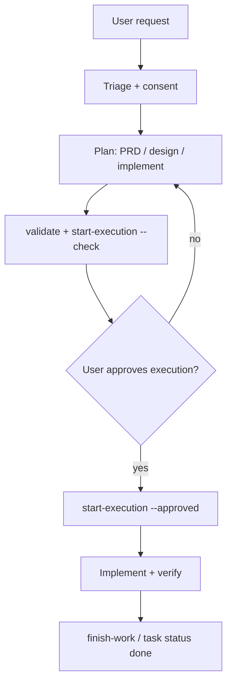

# Workflow in Cursor

English | [简体中文](workflow.zh-CN.md)

This guide explains how to run the **Trellis task lifecycle** inside **Cursor** after `trellis init --cursor`. It is a practical walkthrough—not a full `task.py` API reference.

Canonical rules live in your project’s `.trellis/workflow.md` (generated/updated by Trellis). Cursor agents also see **Request Triage** via `.cursor/rules/trellis-triage.mdc`.

## Prerequisites

1. Install the CLI: `npm install -g @blxzer/cursor-trellis`
2. In your repo root: `trellis init --cursor`
3. Open the project in Cursor and use **Agent** mode for durable work.

Optional: run `python ./.trellis/scripts/get_context.py` in a terminal to see the active task and phase hints.

## Request Triage (every turn)

Before durable work, the agent classifies the user message:

| Mode | When |
| --- | --- |
| **No Task** | Explanation, status, read-only lookup |
| **Micro-Grill** | Small ask, needs clarification first |
| **Lite Task** | Low-risk, single-file, local validation |
| **Full Task** | Cross-file behavior, framework semantics |
| **Parent Task** | Multiple deliverables or integration authority |

The first line of an agent reply should include `[Triage: <Mode>] …`.

**Consent gate:** For Micro-Grill / Lite / Full / Parent, the agent should ask before creating Trellis task artifacts. Consent to create a task is **not** consent to start coding—planning comes first.

## Typical Full Task flow



### 1. Plan (still in Cursor chat)

For a **Full Task**, artifacts under `.trellis/tasks/<slug>/` usually include:

| File | Purpose |
| --- | --- |
| `prd.md` | Goals, scope, acceptance |
| `design.md` | Approach, boundaries, IA |
| `implement.md` | Execution plan + strategy contract |
| `implement.jsonl` / `check.jsonl` | Context manifests |

You can author these with the agent in Cursor. Internal skills (e.g. brainstorm, before-dev) may auto-load on other platforms; on Cursor, follow `.trellis/workflow.md` and explicit user instructions.

### 2. Readiness gates (terminal)

From the **project root** (or harness root when working on Trellis itself):

```bash
python ./.trellis/scripts/task.py validate <task-dir-or-id>
python ./.trellis/scripts/task.py start-execution <task-dir-or-id> --check
```

Fix planning artifacts until both pass. Required reviewer gates (e.g. `requirements-review`) are listed in the check output.

### 3. User approval

The user explicitly approves execution—for example: “批准，执行”.

```bash
python ./.trellis/scripts/task.py start-execution <task-dir-or-id> --approved
```

Status moves to `in_progress`. Only then should the agent modify code or delivery files scoped in `implement.md`.

### 4. Execute in Cursor

- Use normal Cursor tools (edit, terminal, subagents).
- Prefer **`/trellis-continue`** when resuming a long task in a new chat.
- Use **Task subagents** (`trellis-research`, `trellis-implement`, `trellis-check`) for isolated passes when appropriate.
- For **external / current web facts**, project workflow expects **smart-search** first when configured; see [architecture.md](architecture.md#smart-search-integration).

Record context as you go:

```bash
python ./.trellis/scripts/task.py add-context <task> implement <file> "<reason>"
```

### 5. Verify and finish

- Run validation commands listed in `implement.md` (tests, lint, or doc checks).
- Write `verify.md` in the task folder with commands, diff evidence, and risks.
- Close the loop with **`/trellis-finish-work`** or manual status update.

```bash
python ./.trellis/scripts/task.py status <task> done   # when your workflow allows
```

## Lite and Micro-Grill

| Mode | Cursor behavior |
| --- | --- |
| **Lite** | Short `implement.md` or inline plan; may skip heavy PRD; still triage-mark replies |
| **Micro-Grill** | One clarifying question at a time via `trellis-micro-grill` skill semantics |
| **No Task** | Answer directly; no task artifacts |

## Slash commands vs manual scripts

| User action | Cursor | Manual equivalent |
| --- | --- | --- |
| Resume task | `/trellis-continue` | `get_context.py`, read `task.json` |
| Finish work | `/trellis-finish-work` | `task.py` finish helpers per workflow |
| Continue after planning | User says “approve execution” | `start-execution --approved` |

Only **user-invocable** commands belong in the `/` palette. Other Trellis skills are internal and may not appear under `.cursor/skills/` (commands-only policy).

## Keeping workflow current

After upgrading the global CLI:

```bash
npm update -g @blxzer/cursor-trellis
cd /path/to/your-project
trellis update
```

This refreshes `.trellis/workflow.md`, Cursor rules/commands/hooks, and hash-tracked templates. Review diffs when you have customized workflow or rules.

## See also

- [Cursor integration](cursor.md)
- [Architecture](architecture.md)
- [CLI: init / update / uninstall](../packages/cli/README.md)