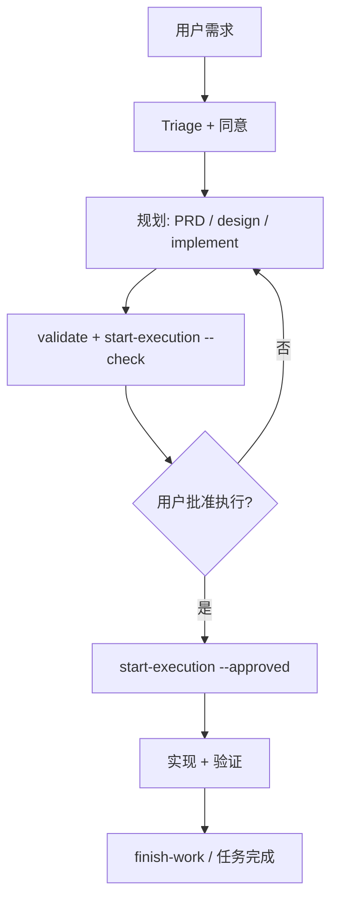

# Cursor 中的工作流

[English](workflow.md) | 简体中文

本文说明在 **`trellis init --cursor`** 之后，如何在 **Cursor** 里跑 Trellis **任务生命周期**。这是实操向指南，不是完整的 `task.py` API 手册。

规范原文在项目 `.trellis/workflow.md`（由 Trellis 生成/更新）。Cursor Agent 还会通过 `.cursor/rules/trellis-triage.mdc` 看到 **Request Triage** 硬门禁。

## 前置条件

1. 安装 CLI：`npm install -g @blxzer/cursor-trellis`
2. 在仓库根目录：`trellis init --cursor`
3. 用 Cursor 打开项目；持久性工作使用 **Agent** 模式。

可选：在终端运行 `python ./.trellis/scripts/get_context.py` 查看当前任务与阶段提示。

## Request Triage（每一轮）

在做持久性改动前，Agent 先分类用户请求：

| 模式 | 适用 |
| --- | --- |
| **No Task** | 解释、状态、只读查询 |
| **Micro-Grill** | 范围不清的小需求，先澄清 |
| **Lite Task** | 低风险、单文件、本地可验证 |
| **Full Task** | 跨文件行为、框架语义 |
| **Parent Task** | 多交付物或集成编排 |

回复首行应包含 `[Triage: <Mode>] …`。

**同意门：** Micro-Grill / Lite / Full / Parent 下，创建 Trellis 任务工件前应征得用户同意。同意建任务 **不等于** 同意立刻写代码——先规划。

## 典型 Full Task 流程



### 1. 规划（仍在 Cursor 对话中）

**Full Task** 常见工件目录：`.trellis/tasks/<slug>/`

| 文件 | 用途 |
| --- | --- |
| `prd.md` | 目标、范围、验收 |
| `design.md` | 方案、边界、信息架构 |
| `implement.md` | 执行计划 + 策略契约 |
| `implement.jsonl` / `check.jsonl` | 上下文清单 |

可在 Cursor 中与 Agent 共创。其他平台可能自动加载内部 skill；在 Cursor 上以 `.trellis/workflow.md` 与用户指示为准。

### 2. 就绪门禁（终端）

在**项目根**（维护 Trellis 源码时则在 harness 约定目录）：

```bash
python ./.trellis/scripts/task.py validate <任务目录或 id>
python ./.trellis/scripts/task.py start-execution <任务目录或 id> --check
```

直至通过。检查输出会列出所需评审门（如 `requirements-review`）。

### 3. 用户批准

用户明确批准执行，例如：“批准，执行”。

```bash
python ./.trellis/scripts/task.py start-execution <任务目录或 id> --approved
```

状态变为 `in_progress`。此后才应按 `implement.md` 修改代码或交付物。

### 4. 在 Cursor 中执行

- 使用 Cursor 编辑、终端、子 Agent 等工具。
- 长任务新开会话时优先 **`/trellis-continue`**。
- 适合时用 **Task 子 Agent**（`trellis-research`、`trellis-implement`、`trellis-check`）做隔离阶段。
- **外部/时效性事实**：项目 workflow 约定在配置正常时 **优先 smart-search**；见 [architecture.zh-CN.md](architecture.zh-CN.md#smart-search-集成)。

可记录上下文：

```bash
python ./.trellis/scripts/task.py add-context <task> implement <file> "<reason>"
```

### 5. 验证与收尾

- 按 `implement.md` 运行验证（测试、lint 或文档检查）。
- 在任务目录写 `verify.md`（命令、diff 证据、风险）。
- 用 **`/trellis-finish-work`** 或按 workflow 更新状态。

```bash
python ./.trellis/scripts/task.py status <task> done   # 若 workflow 允许
```

## Lite 与 Micro-Grill

| 模式 | Cursor 行为 |
| --- | --- |
| **Lite** | 简短 `implement.md` 或内联计划；仍须 Triage 标记 |
| **Micro-Grill** | 按 `trellis-micro-grill` 语义一次问清一点 |
| **No Task** | 直接回答，不建任务工件 |

## 斜杠命令与手工脚本

| 用户动作 | Cursor | 手工等价 |
| --- | --- | --- |
| 继续任务 | `/trellis-continue` | `get_context.py`、读 `task.json` |
| 收尾 | `/trellis-finish-work` | workflow 中的 finish 辅助 |
| 规划后开干 | 用户说批准执行 | `start-execution --approved` |

**仅用户可调用**的命令出现在 `/` 面板；其他 Trellis skill 为内部能力，Cursor 默认不写入 `.cursor/skills/`（commands-only）。

## 保持 workflow 最新

升级全局 CLI 后：

```bash
npm update -g @blxzer/cursor-trellis
cd /path/to/your-project
trellis update
```

会刷新 `.trellis/workflow.md`、Cursor rules/commands/hooks 等。若你自定义过 workflow 或 rules，请审阅 diff。

## 延伸阅读

- [Cursor 集成](cursor.zh-CN.md)
- [架构概览](architecture.zh-CN.md)
- [CLI：init / update / uninstall](../packages/cli/README.zh-CN.md)