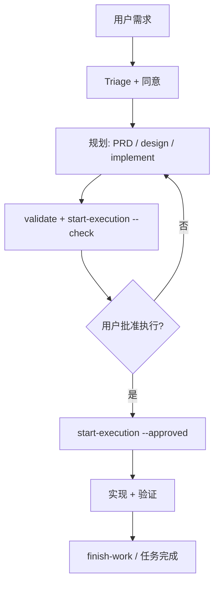

# Cursor 中的工作流

[English](workflow.md) | 简体中文

本文说明在 `trellis init --cursor` 之后,如何在 Cursor 里跑 Trellis **任务生命周期**。覆盖完整生命周期:Request Triage、Task Ladder、规划工件、Parent/Child 任务树、三阶段(Plan → Execute → Finish)以及 Lite、Micro-Grill、No Task 三种模式的差异。

规范原文在项目 `.trellis/workflow.md`(由 Trellis 生成/更新)。Cursor Agent 还会通过 `.cursor/rules/trellis-triage.mdc` 看到 **Request Triage** 硬门禁。

## 前置条件

1. 安装 CLI:`npm install -g @blxzer/cursor-trellis`
2. 在仓库根目录:`trellis init --cursor`
3. 用 Cursor 打开项目;持久性工作使用 **Agent** 模式。

可选:在终端运行 `python ./.trellis/scripts/get_context.py` 查看当前任务与阶段提示。

## Request Triage(每一轮)

做持久性改动前,Agent 按决策树分类用户消息。这是**硬门禁**,不是建议——每个能产生工作的回合必须先分类,再做任何动作。

决策树(首条匹配为准):

1. **无持久项目改动**(对话、状态、解释、只读查询、一次性小动作)→ `No Task`
2. **范围不清的小需求,尚未建任务**(需要聚焦澄清或决策压力才能判断是否有工作)→ `Micro-Grill`
3. **低风险持久工作,范围窄,本地可验证,无共享契约改动** → `Lite Task`
4. **持久代码/模板/运行时/工作流/跨文件行为或框架语义** → `Full Task`
5. **多个独立交付物、分阶段/并行执行、或必须由 Parent 拥有的最终集成权限** → `Parent Task / Child Tasks`

回复首行必须包含分类标记:

```
[Triage: <Mode>] <一句理由,引用触发信号>
```

`<Mode>` ∈ `No Task | Micro-Grill | Lite | Full | Parent`。理由必须引用触发信号(如"跨文件工作流改动"、"只读解释")。`No Task` 回合仍需标记——这是用户审计分类是否发生的方式。

### 同意门

分类为 Micro-Grill / Lite / Full / Parent 后,Agent 在创建任何 Trellis 工件前**征求任务创建同意**。同意建任务**不等于**同意立刻写代码——先规划。若用户对简单需求拒绝建任务,本次会话跳过 Trellis。

### 已选任务连续性

当 `selected_task` 已存在时,Agent **不**在每个后续回合重跑全局分类。它继续在已选任务内,除非存在强冲突:明确的退出/切换/创建语言、范围外请求、不同任务工件或归档目标、新独立交付物、契约改动请求、或证据污染风险。

## Task Ladder 与路由

按**风险与持久性**分类,而非工作量大小。对持久框架语义的短改动可能需要 Full Task;不留下持久项目状态的长对话可保持 No Task。

| 模式 | 适用 | 触发信号 | 持久工件 |
| --- | --- | --- | --- |
| **No Task** | 对话、状态、解释、只读查询、无持久项目改动的一次性小动作。 | explain / status / lookup / read-only / one-liner | 无。除非升级否则不归档。 |
| **Micro-Grill** | 需要聚焦澄清、决策压力、或小需求审问才能判断是否有工作。 | 小+范围不清 / "看情况" / 需澄清 / 先决策树 | 通常无。持久编辑/验证/门禁/归档证据前先升级。 |
| **Lite Task** | 低风险持久工作,范围窄,本地可验证,无共享契约改动。 | 低风险 / 单文件 / 本地验证 / 无契约 / 窄范围 | `task.json`、`prd.md`、`verify.md`、归档证据。 |
| **Full Task** | 持久代码/模板/运行时/工作流/跨文件行为,设计/执行策略/验证/评审门重要时。 | 跨文件 / 框架语义 / 契约改动 / 模板 / 运行时 / 工作流 / 多文件行为 | `prd.md`、`design.md`、`implement.md`、`verify.md`、Development Strategy Contract、`verification_profile`、`quality_gates`、归档证据。 |
| **Parent Task / Child Tasks** | 一个请求含独立交付物、分阶段/并行执行、或必须由 Parent 拥有的最终集成权限。 | 多个独立交付物 / 分阶段 / 并行 / 集成权限 | Parent `task-map.md`、Child 任务工件、Child 交接证据、Parent 最终集成证据。 |

### 升降级规则

- **No Task → Micro-Grill**:回合需要结构化澄清或决策树才能安全分类。
- **Micro-Grill → Lite/Full**:结果需要持久任务工件、仓库编辑、验证证据、质量门或归档。
- **Lite → Full**:范围触及共享契约、多文件行为、框架语义、平台/运行时/能力假设、`verification_profile`、`quality_gates`、或回滚敏感验证。
- **Full → Parent/Child**:仅当工作有独立交付物、分阶段/并行执行、或 Parent 控制的最终集成需求时。

执行升级前(创建工件、改任务模式、加门、改 `verification_profile` 或能力、改批准要求),必须获得用户明确确认。**每次降级都需要用户明确确认**,因为降级降低了工件/门/验证/批准的严格度。

### 快速路由

| 情况 | 动作 |
| --- | --- |
| 无已选任务 + 小范围不清需求 | `trellis-micro-grill` |
| 无已选任务 + 需要看板 | `trellis-start` |
| 已选任务 + 继续步骤 | `/trellis-continue` |
| 规划 / PRD | `trellis-brainstorm` |
| Parent 带并行 children | `generate-child-prompt --mode subagent`(可写 Agent) |

## 规划工件

| 文件 | 用途 |
| --- | --- |
| `prd.md` | 目标、需求、约束、验收标准。**不要**放技术设计或执行清单。 |
| `design.md` | 复杂任务的技术设计:边界、契约、数据流、权衡、兼容性、发布/回滚形态。 |
| `implement.md` | 复杂任务的执行计划:有序清单、Development Strategy Contract、验证命令、评审门、回滚点。 |
| `implement.jsonl` / `check.jsonl` | 子 Agent 上下文的 spec 与研究 manifest。**不替代** `implement.md`。 |
| `verification_profile` / `quality_gates` | 任务工件与 `task.json` 中的门策略;`task.json.quality_gate_results` 存紧凑机器可校验状态。 |

轻量任务可仅有 PRD。复杂任务在 `task.py start-execution --check` 前必须有 `prd.md`、`design.md`、`implement.md`。

## Parent / Child 任务树

当一个用户请求含多个可独立验证的交付物时,用 **Parent** 任务。Parent 拥有源需求集、任务地图、跨 child 验收标准、最终集成评审;通常不应是实现目标,除非它也有直接工作。

**Child** 任务用于可独立规划、实现、检查、归档的交付物。Parent/Child **不是**依赖系统:若一个 child 必须等另一个,把顺序写在 child 的 `prd.md`/`implement.md`,保持每个 child 的验收标准可测。

- 创建 child:`task.py create "<标题>" --slug <名> --parent <parent-dir>`
- 关联已有:`task.py add-subtask <parent> <child>`
- Parent 编排:`task.py parent-status`、`generate-child-prompt`、`review-child`

**集成权限只属 Parent。** `merge_limit: 1` 阻止多于一个 Child 同时 `integrating`。Child 可提供证据并请求评审,但不能自标 `changes`/`accepted`/`integrating`/`integrated`/`cancelled`。Parent 集成默认是串行 Git-ref 集成;每次决策写入 `task-map.md` Event Log。

集成仅限 Parent/Child。普通 Lite 和 Full Task 跳过集成,从验证/评审直接到归档/学习。

## 典型 Full Task 流程



### 1. 规划(Phase 1)

**1.1 Brainstorm(Discovery + PRD Grill)。** Phase A——提问前 Discovery:检查代码、测试、spec、历史、平台文件、parent/child 结构;记录已确认事实,起草 `prd.md`。Phase B——PRD Grill:对 `prd.md` 跑 12 项检查,然后只对 **blocking** 开放问题逐个 micro-grill(附推荐答案 + 权衡)。每个答案后更新 `prd.md`。

**1.2 研究(可选)。** 某主题需要专门 `{TASK}/research/<主题>.md` 时派发 `trellis-research`。外部事实强制首选 smart-search(Cursor WebSearch 为降级)。研究输出必须写文件,不只留在对话。

**1.3 配置上下文。** 维护 `implement.jsonl` 和 `check.jsonl` 让 Phase 2 子 Agent 获得正确 spec/研究上下文。格式:每行一个 JSON 对象 `{"file": "<路径>", "reason": "<原因>"}`。放 spec 文件和研究文件;**不要**放即将修改的代码文件。用 `get_context.py --mode packages` 发现相关 spec。

**1.4 执行门禁。** 运行非变更预检:

```bash
python ./.trellis/scripts/task.py start-execution <任务目录> --check
```

复杂任务须有 `prd.md`、`design.md`、`implement.md` 并已评审。`--check` 通过后,报告工件门就绪(含任务路径 + 契约/指纹上下文),请求明确执行批准。此预检前的普通同意("确认"、"好"、"开始")**不是**执行批准。

用户批准执行后,运行:

```bash
python ./.trellis/scripts/task.py start-execution <任务目录> --approved
```

状态变为 `in_progress`。此后才应按 `implement.md` 修改代码。

### 2. 执行(Phase 2)

执行受已批准的 `prd.md`、`design.md`、`implement.md`、Development Strategy Contract 约束。不要全局重分类、自动切任务、自动创新范围、或改规划工件以变范围/设计/契约却假装执行仍被批准。

**2.1 实现。** 上下文不完整时,实现前与实现中使用检索层(见 [retrieval.zh-CN.md](retrieval.zh-CN.md))。派发 `trellis-implement` 子 Agent(Full/Parent——Cursor):主会话通过 Trellis 脚本组装完整派发 prompt,再 `Task(subagent_type=trellis-implement, prompt=<已组装>)`。在 Cursor 上**不要**仅依赖 `preToolUse` 钩子注入上下文。

**2.2 质量检查。** 派发 `trellis-check` 子 Agent:对照 spec 与规划工件评审代码;仅在已批准契约内修实现缺陷;需求/设计/契约/范围/能力缺陷路由回规划。跑 lint 和 typecheck。

**2.3 回滚。** `check` 揭示契约改动缺陷 → 返回规划,刷新门/指纹,再次获明确批准。实现出错 → 还原代码,重做 2.1。需更多研究 → 研究(同 1.2),写入 `research/`。

### 3. 收尾(Phase 3)

**3.1 质量验证。** 加载 `trellis-check` 做最终评审:spec 合规、lint/type-check/测试、跨层一致性、检索证据(最终结论必须引用当前源码、Git 或验证证明)。在 `verify.md` 写人可读验证、评审、验收证据。验证期间不要静默修或扩范围。可选运行 `get_context.py --mode retrieval-pack` 对收集证据评分。

**3.2 调试回顾(按需)。** 若任务涉及反复调试(同一问题修多次),加载 `trellis-break-loop` 分类根因、解释早期修复为何失败、提出预防。

**3.3 学习决策。** 审查任务是否产生值得记录的持久学习(反复失败环、需求漂移、架构决策、可复用约定、工具链坑)。若有,加载 `trellis-update-spec` 更新 `.trellis/spec/` 或写聚焦 `retrospective.md`,从 `verify.md` 链接。若无持久学习,在 `verify.md` 写明确 `No durable learning` 决策。

**3.4 提交。** Agent 驱动批量提交:查 `git status --porcelain`,从 `git log --oneline -5` 学提交风格,把脏文件分"本次 AI 编辑"(工作提交先)与"记账"(归档+日志提交后)。工作提交先于记账——不交错。

**3.5 归档。** 用 `/trellis-finish-work` 或手动状态更新闭环:

```bash
python ./.trellis/scripts/task.py status <task> done   # 若 workflow 允许
```

归档前,`verify.md` 须含验证证据、最终验收证据、门/评审引用(适用时)、持久学习决策。带 child 的 Parent 还须含最终集成证据。

## Lite 与 Micro-Grill

| 模式 | Cursor 行为 |
| --- | --- |
| **Lite** | 简短 `implement.md` 或内联计划;可跳重型 PRD;仍须 Triage 标记;归档前仍需 `verify.md` 中验证+验收+学习证据 |
| **Micro-Grill** | 按 `trellis-micro-grill` 语义一次问清一点;默认无任务工件;持久编辑前先升级 |
| **No Task** | 直接回答,不建任务工件 |

## workflow-state breadcrumb

Cursor 的 `UserPromptSubmit` 钩子读 `.trellis/workflow.md` 内嵌的 `[workflow-state:*]` 块,注入每回合显示当前阶段(`no_task`/`planning`/`in_progress`)的 breadcrumb。这是每回合阶段提示的唯一真相源。规范契约在 `.trellis/workflow.md`;公开文档此处仅概述。若钩子找不到标签,降级为可见的"Refer to workflow.md for current step."行,让用户注意到并修复损坏的 `workflow.md`。

## 斜杠命令与手工脚本

| 用户动作 | Cursor | 手工等价 |
| --- | --- | --- |
| 继续任务 | `/trellis-continue` | `get_context.py`、读 `task.json` |
| 收尾 | `/trellis-finish-work` | workflow 中的 finish 辅助 |
| 规划后开干 | 用户说批准执行 | `start-execution --approved` |

**仅用户可调用**的命令出现在 `/` 面板;其他 Trellis skill 为内部能力,Cursor 默认不写入 `.cursor/skills/`(commands-only)——见 [Cursor 集成](cursor.zh-CN.md)。

## 保持 workflow 最新

升级全局 CLI 后:

```bash
npm update -g @blxzer/cursor-trellis
cd /path/to/your-project
trellis update
```

刷新 `.trellis/workflow.md`、Cursor rules/commands/hooks、哈希跟踪模板。若自定义过 workflow 或 rules,审阅 diff。

## 延伸阅读

- [Cursor 集成](cursor.zh-CN.md)——双环境派发、检索注入通道
- [检索层设计](retrieval.zh-CN.md)——适配器栈、路由器、证据评分
- [架构概览](architecture.zh-CN.md)
- [CLI:init / update / uninstall](../packages/cli/README.zh-CN.md)
